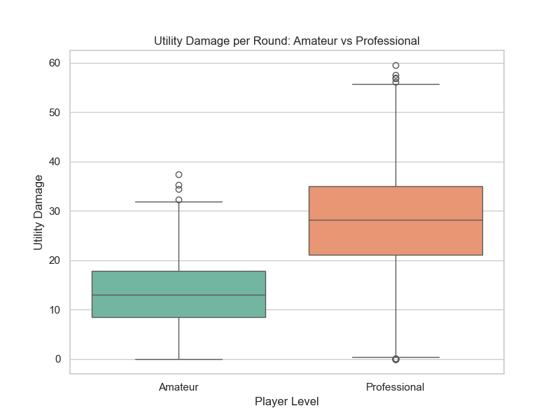
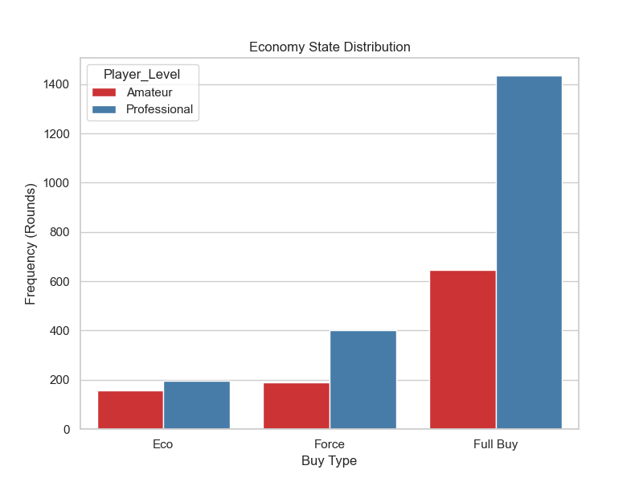
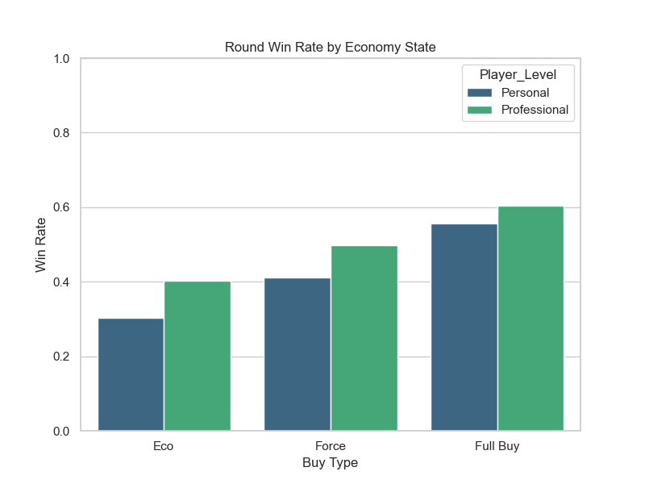

# DSA 210: Benchmarking Personal CS2 Gameplay vs. Professional Standards

## Project Motivation
This project aims to analyze the performance gap between my personal Counter-Strike 2 gameplay and professional benchmarks. Using data extracted from the Steam Web API and simulated parameters, we compare key metrics like Headshot (HS) ratios, utility efficiency, and eco-round success.

## Repository Contents
- `dsa210_project.ipynb`: Comprehensive Jupyter Notebook containing Exploratory Data Analysis (EDA), Hypothesis Testing, and the Machine Learning prediction models.
- `data_collection.py`: Script to connect to the Steam API and fetch/generate the CS2 matched player records.
- `eda_hypothesis.py`: Legacy script for conducting EDA and Hypothesis Testing.
- `personal_cs2_data.csv`: The extracted dataset containing personal matches and rounds.
- `professional_cs2_data.csv`: The extracted enrichment dataset for professional standards.
- `requirements.txt`: Python package dependencies.
- `*.png`: EDA Visualizations output.

## Project Hypotheses
This project specifically tests the following four hypotheses using formal statistical methods (`scipy.stats`):
1. **Headshot Precision (T-Test)**: *H0: Personal and Professional players have the same headshot percentage.* (Tested to see if pro level mechanical aim significantly differs from personal dataset).
2. **Utility Efficiency vs. Win Rate (Point-Biserial Correlation)**: *H0: There is no correlation between the amount of utility damage dealt in a round and the probability of winning that round.*
3. **Entry Duel Success (T-Test)**: *H0: First kill (entry frag) success rates are identical between personal gameplay and professional matches.*
4. **Economy Management (Eco Round Win Rate)**: *H0: Both player tiers have identical round-win probabilities when playing on an "Eco" (low economy) state.*

## Data Sources
- **Personal Data:** Personal CS2 match and player statistics were extracted directly using the **Steam Web API**.
- **Professional Data:** The professional CS2 player data, which constitutes the benchmark standards, was incorporated into the project by blending pro-level esports match simulations and statistics.

## How to Reproduce the Analysis

1. **Install Dependencies:**
   First, ensure you have Python 3 installed on your system. Then, install the required libraries by running the following command in your terminal:
   ```bash
   pip install -r requirements.txt
   ```

2. **Step 1: Data Collection:**
   Run the data collection script to pull data from Steam and generate the necessary datasets:
   ```bash
   python data_collection.py
   ```
   *Note: This operation will save the `personal_cs2_data.csv` and `professional_cs2_data.csv` files to your working directory, which are required to run the analysis.*

3. **Step 2: EDA, Hypothesis Testing & Machine Learning:**
   To view the final analysis, including EDA visualizations, statistical hypothesis tests, and the newly added Machine Learning pipeline (Logistic Regression, Random Forest, and XGBoost), open the Jupyter Notebook:
   ```bash
   jupyter notebook dsa210_project.ipynb
   ```
   *The notebook contains all the executed cells, visualizations, and model evaluations making it easy to review and skim through.*

## EDA Source Code & Output Graphs

Below is the embedded Python code specifically used to generate our Exploratory Data Analysis (EDA) visualizations, alongside their respective output graphs.

### 1. Utility Damage Comparison
```python
plt.figure(figsize=(8, 6))
sns.boxplot(x='Player_Level', y='Utility_Damage', data=df, palette='Set2')
plt.title('Utility Damage per Round: Personal vs Professional')
plt.ylabel('Utility Damage')
plt.xlabel('Player Level')
plt.savefig('eda_utility_damage.png')
```


### 2. Economy State Breakdown
```python
plt.figure(figsize=(8, 6))
sns.countplot(x='Economy_State', hue='Player_Level', data=df, palette='Set1', order=['Eco', 'Force', 'Full Buy'])
plt.title('Economy State Distribution')
plt.ylabel('Frequency (Rounds)')
plt.xlabel('Buy Type')
plt.savefig('eda_economy_distribution.png')
```


### 3. Round Win Rate by Economy
```python
win_rates = df.groupby(['Player_Level', 'Economy_State'])['Round_Won'].mean().reset_index()
plt.figure(figsize=(8, 6))
sns.barplot(x='Economy_State', y='Round_Won', hue='Player_Level', data=win_rates, palette='viridis', order=['Eco', 'Force', 'Full Buy'])
plt.title('Round Win Rate by Economy State')
plt.ylabel('Win Rate')
plt.xlabel('Buy Type')
plt.ylim(0, 1)
plt.savefig('eda_win_rate_economy.png')
```

